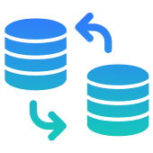
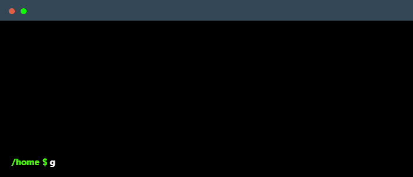

  

<h3 align="center">CAPTURE DATA CHANGE</h3>

  

    Playing around with Capture Data Change using Debezium
     
    <a href="https://github.com/Cherni-Oussama/CDC-DEBEZIUM/README.md"><strong>Explore the docs »</strong></a>
     
     
    <a href="">View Demo</a>
    ·
    <a href="https://github.com/Cherni-Oussama/CDC-DEBEZIUM/issues">Report Bug</a>
    ·
    <a href="https://github.com/Cherni-Oussama/CDC-DEBEZIUM/issues">Request Feature</a>
  

  
Table of Contents

  <ol>
    <li>
      <a href="#about-the-project">About The Project</a>
      <ul>
        <li><a href="#built-with">Built With</a></li>
      </ul>
    </li>
    <li>
      <a href="#getting-started">Getting Started</a>
      <ul>
        <li><a href="#prerequisites">Prerequisites</a></li>
        <li><a href="#installation">Installation</a></li>
      </ul>
    </li>
    <li><a href="#usage">Usage</a></li>
    <li><a href="#Resources">Resources</a></li>
    <li><a href="#authors">Authors</a></li>
  </ol>

# Spring Boot Kafka Postgres Connectors

## About The Project

This repository contains two Spring Boot applications that demonstrate the use of Debezium Postgres and JDBC Sink connectors for data streaming from a Postgres database to Kafka using both JSON and Avro converters.

### Built with 

## Getting Started

These instructions will get you a copy of the project up and running on your local machine for development and testing purposes.

### Prerequisites

- Docker
- Docker Compose
- Java 8 or higher

### Branches

- `CDC-JSON_CONVERTER` branch: Demonstrates the use of JSON converter for data streaming.
- `CDC-AVRO_CONVERTER` branch: Demonstrates the use of Avro converter for data streaming.

### Installation

  <a href="[https://github.com/Cherni-Oussama/CDC-DEBEZIUM](https://github.com/Cherni-Oussama/CDC-DEBEZIUM)">
      

1. Clone the repository.

`git clone https://github.com/Cherni-Oussama/kafka-debezium-data-streaming.git`

2. Checkout for the specifific branch you want to test
`git checkout CDC-JSON_CONVERTER` or `git checkout CDC-AVRO_CONVERTER`

## Usage
1. Build the project.
`docker compose up`.

2. Verify that all containers are up.
`docker ps` or you could check them from *Docker Desktop*

3. Navigate to the Upstream application Swagger page and try to create new Company or Employee
http://localhost:8010/swagger-ui/index.html#/employee-controller/addEmployee

4. Verify that data is being streamed from the Postgres databases to Kafka.

- connect to kafka container : In CMD `docker exec -it kafka bash`
- list the topics created : `kafka-topics --bootstrap-server localhost:9092 --list`
- consumer the messages created in the created topic : `kafka-console-consumer --bootstrap-server localhost:9092 --topic topicName --from-beginning`
 
5. Verify that data is being streamed from the kafka to postgres sink database.
- connect to postgres sink database : `docker exec -it postgres-sink-db`
- Authentification: `psql -U postgres`
- list the created tables `\dt`.

### Resources

* Debezium Postgres Connector: [https://debezium.io/documentation/reference/connectors/postgresql.html](https://debezium.io/documentation/reference/connectors/postgresql.html)
* JDBC Sink Connector: [https://docs.confluent.io/platform/current/connect/kafka-connect-jdbc/sink-connector/index.html](https://docs.confluent.io/platform/current/connect/kafka-connect-jdbc/sink-connector/index.html)

## Authors
* [**Cherni Oussama**](https://github.com/Cherni-Oussama)

